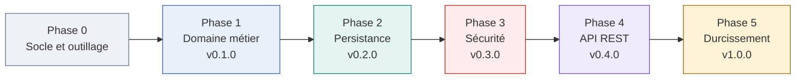
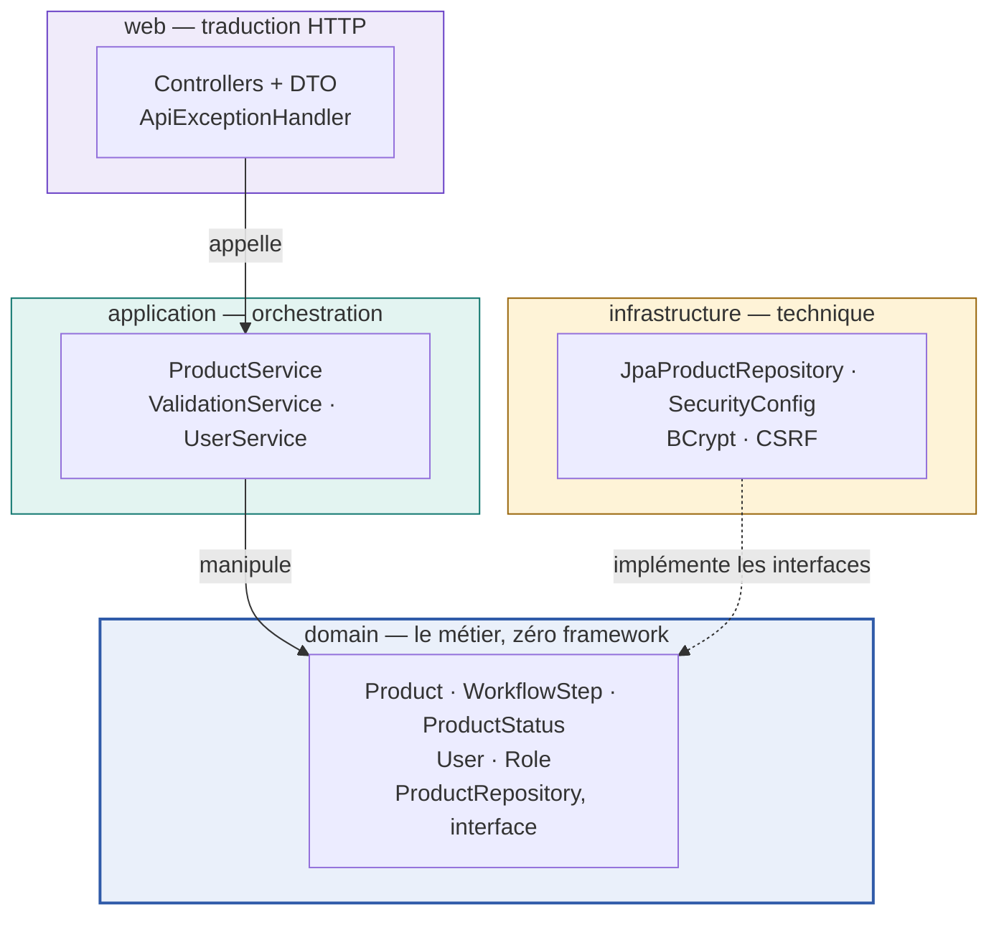
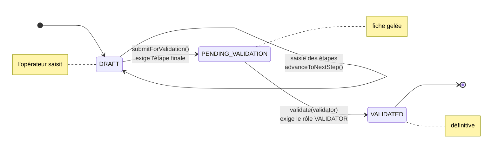
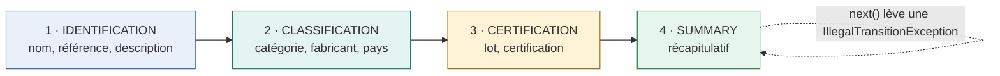
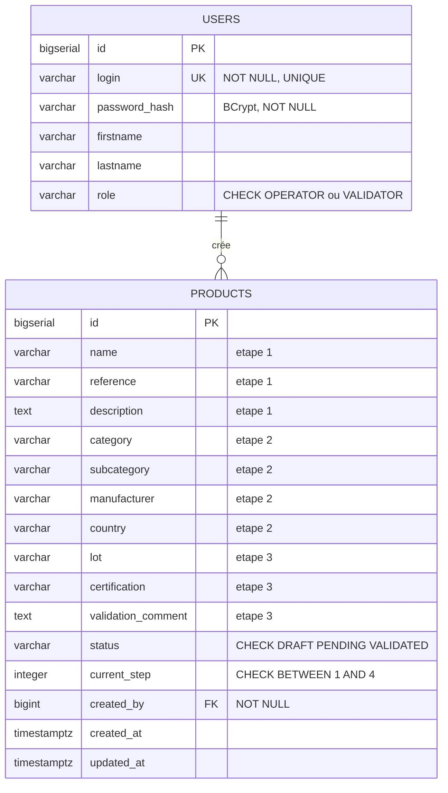
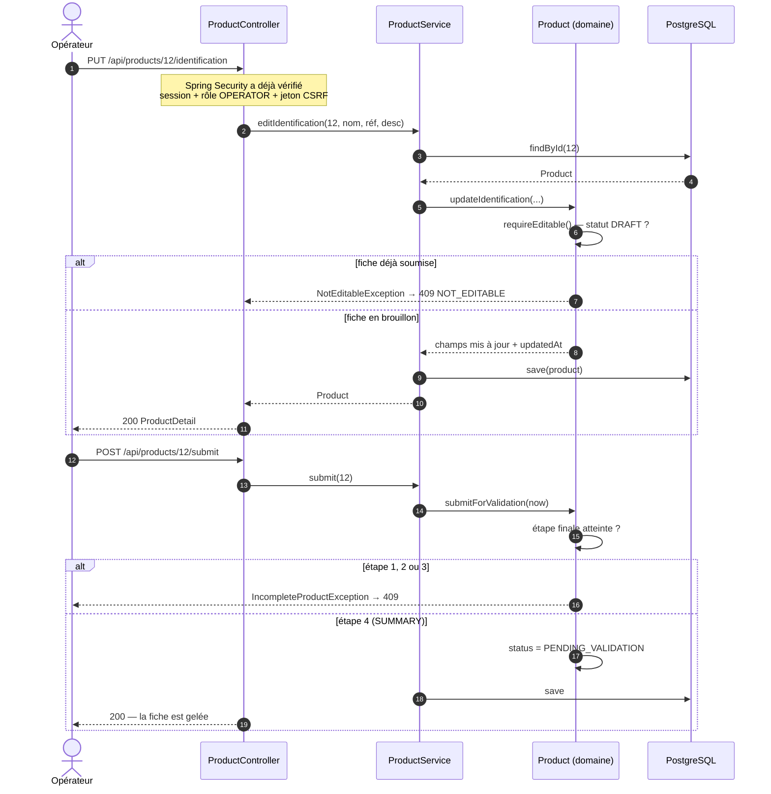
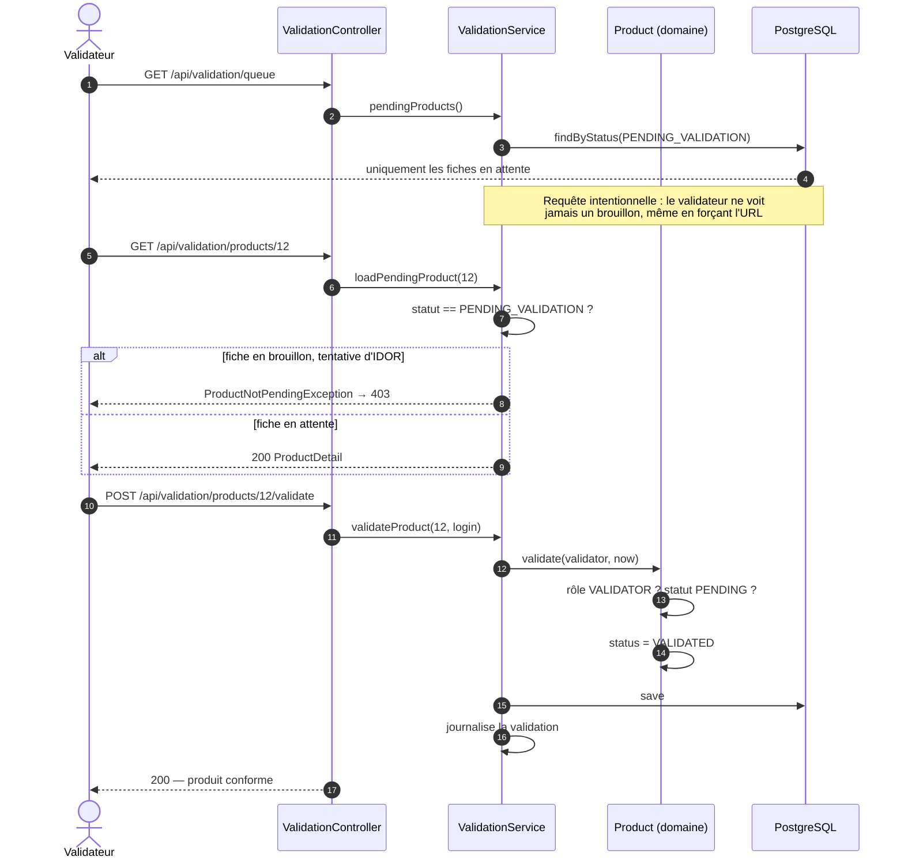
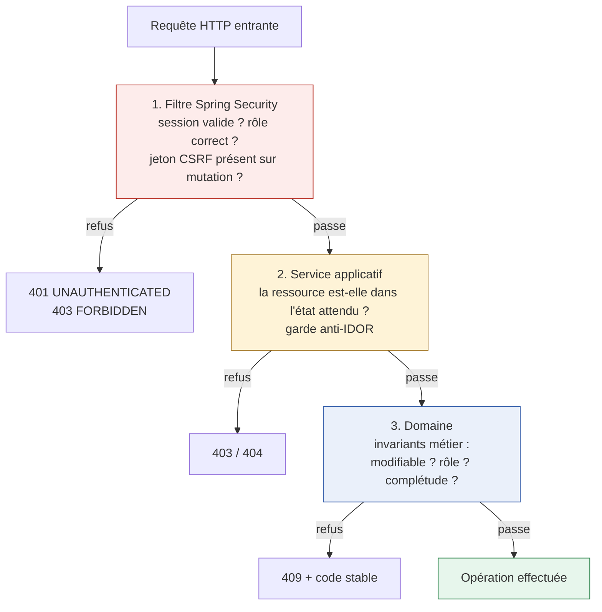
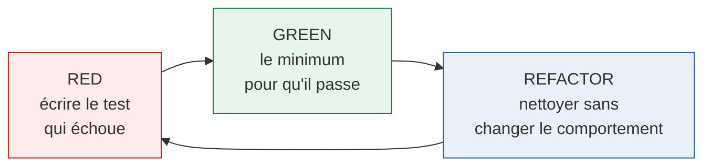
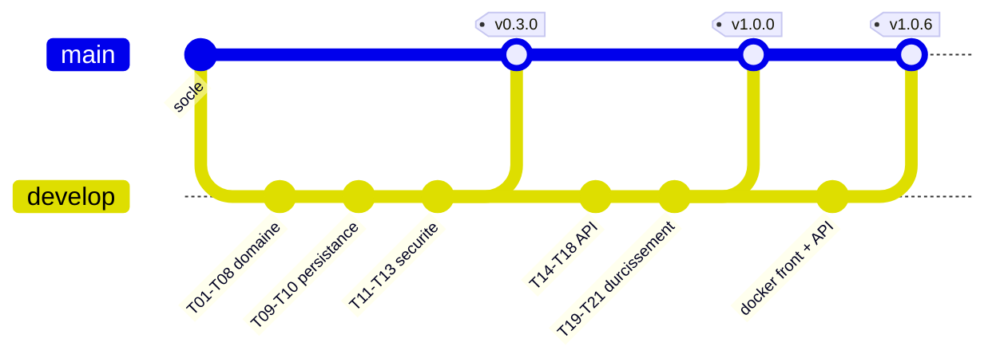

# DataCom — Dossier technique

Réécriture &amp; sécurisation d'une application monolithique · Backend API REST · v1.0.6

**Stack** : Java 21 · Spring Boot 3.5 · PostgreSQL 16 · Flyway · Maven · Docker

| Indicateur | Valeur |
|---|---|
| Lignes de production | 1 194 |
| Tests automatisés | 104 |
| Endpoints REST | 13 |
| Couverture exigée | 80 % global · 90 % `domain` + `application` |
| Commentaires en production | 0 (règle vérifiée automatiquement) |

## Sommaire

1. [Le legacy et sa dette technique](#1-le-legacy-et-sa-dette-technique)
2. [Stratégie de refonte](#2-stratégie-de-refonte)
3. [Architecture en couches](#3-architecture-en-couches)
4. [Le domaine métier](#4-le-domaine-métier)
5. [Base de données et tables](#5-base-de-données-et-tables)
6. [Design patterns retenus](#6-design-patterns-retenus)
7. [Flux des cas d'usage](#7-flux-des-cas-dusage)
8. [Sécurité](#8-sécurité)
9. [Tests et qualité](#9-tests-et-qualité)
10. [Git et collaboration](#10-git-et-collaboration)
11. [Bilan et limites assumées](#11-bilan-et-limites-assumées)

---

## 1. Le legacy et sa dette technique

L'application d'origine permet à un **opérateur de saisie** d'enregistrer des fiches produits en quatre étapes, puis à un **responsable conformité** de les valider avant mise sur le marché. Le besoin métier est sain ; c'est la réalisation technique qui posait problème.

| Dette constatée | Conséquence concrète | Réponse apportée |
|---|---|---|
| SQL concaténé à la main (JDBC) | Injection SQL possible | Requêtes paramétrées via JPA — injection impossible par construction |
| Mots de passe faiblement protégés | Compromission en cas de fuite de base | BCrypt (salage + coût adaptatif) |
| Logique métier dans les servlets/JSP | Règles dupliquées, intestables | Domaine isolé, sans framework, testable en millisecondes |
| Aucun contrôle d'accès par ressource | IDOR : un utilisateur atteint la fiche d'un autre | Défense en profondeur : route → service → domaine |
| Aucun test automatisé | Toute modification est un pari | 104 tests bloquants en intégration continue |
| Erreurs techniques renvoyées brutes | Fuite de stack traces et de détails internes | Format `problem+json` uniforme, 500 neutre |
| Java 11 en fin de support | Risque de sécurité, pas de correctifs | Java 21 LTS |

> **Décision structurante — réécriture plutôt que refactoring progressif.**
> Le périmètre fonctionnel est petit et parfaitement connu (5 fonctionnalités, 2 rôles). Refactorer progressivement un monolithe où la logique est diluée dans les JSP aurait coûté plus cher que de réécrire le cœur métier proprement, tout en conservant la dette de sécurité pendant toute la transition. La réécriture permet de repartir sur des invariants explicites et testés.

---

## 2. Stratégie de refonte

La refonte a été livrée en **six phases incrémentales**, chacune terminée par une version taguée et une CI verte. Chaque phase produit un logiciel qui fonctionne : jamais de « grand bang » final.



> **Pourquoi cet ordre ?**
> Le domaine d'abord, car c'est lui qui porte les règles à préserver : tant qu'il n'est pas juste, câbler une base ou une API n'a pas de sens. La persistance ensuite, la sécurité **avant** l'exposition HTTP (jamais d'API ouverte « qu'on sécurisera après »), et l'API en dernier, comme une simple couche de traduction.

---

## 3. Architecture en couches

Quatre couches, avec une règle unique : **toutes les dépendances pointent vers le domaine**, et le domaine ne dépend de rien.



La flèche en pointillés est le cœur de l'affaire : l'infrastructure **implémente** une interface définie par le domaine. C'est l'**inversion de dépendance** — le métier commande, la technique obéit.

| Couche | Responsabilité | A le droit de connaître | Classes |
|---|---|---|---|
| `domain` | Les règles métier et leurs invariants | Rien (ni Spring, ni HTTP, ni SQL) | 11 |
| `application` | Orchestrer un cas d'usage, ouvrir la transaction | Le domaine | 6 |
| `infrastructure` | Base de données, sécurité, technique | Le domaine | 9 |
| `web` | Traduire HTTP ↔ métier | Application | 12 |

> **Cette règle n'est pas qu'un principe : elle est exécutable.**
> `ArchitectureRulesTest` (ArchUnit) fait **échouer la CI** si une classe du domaine importe Spring, ou si une couche contourne l'ordre établi. Une règle écrite dans un document se contourne ; une règle testée, non.

> **Pourquoi pas une architecture hexagonale complète ?**
> C'était une option, envisagée puis écartée. Elle aurait imposé des ports/adapters des deux côtés et un mapping domaine ↔ entité JPA, soit une couche d'objets supplémentaire pour un CRUD métier de 1 200 lignes. J'ai retenu une architecture **en couches dirigée vers le domaine** : elle conserve le bénéfice essentiel (domaine pur, dépendances inversées) sans le coût de l'indirection. C'est l'application directe de YAGNI — l'architecture la plus adaptée, pas la plus impressionnante.

---

## 4. Le domaine métier

Une fiche produit se remplit en quatre étapes puis suit trois statuts. Ces deux dimensions sont distinctes, et c'est important : l'**étape** dit où en est la saisie, le **statut** dit qui contrôle la fiche.





### Trois invariants protégés par le code lui-même

Le point clé : ces règles ne sont pas des `if` éparpillés dans les contrôleurs, elles vivent **dans l'objet**. Il est donc impossible de les contourner, quel que soit le chemin d'appel.

```java
// 1 — une fiche soumise ou validée n'est plus modifiable
private void requireEditable() {
    if (!isEditable()) { throw new NotEditableException(); }
}

// 2 — on ne soumet pas une fiche incomplète
public void submitForValidation(Instant at) {
    requireEditable();
    if (!currentStep.isFinal()) { throw new IncompleteProductException(currentStep); }
    this.status = ProductStatus.PENDING_VALIDATION;
}

// 3 — seul un validateur valide, et seulement une fiche en attente
public void validate(User validator, Instant at) {
    if (!validator.hasRole(Role.VALIDATOR)) { throw new ValidationNotAllowedException(); }
    if (status != ProductStatus.PENDING_VALIDATION) { throw new IllegalStateException(...); }
    this.status = ProductStatus.VALIDATED;
}
```

> **Pourquoi un contrôle de rôle dans le domaine, alors qu'il existe déjà côté HTTP ?**
> Parce que « seul un responsable conformité valide » est une **règle métier**, pas une règle de routage. Si demain la validation est déclenchée par un batch ou un autre point d'entrée, la règle tient toujours. C'est le troisième niveau de la défense en profondeur décrite en §8.

---

## 5. Base de données et tables



### Les choix de modélisation, et pourquoi

| Choix | Justification |
|---|---|
| **Deux tables seulement** | Le métier ne comporte que deux concepts. Découper les étapes en tables séparées aurait produit des jointures permanentes pour un gain nul : une fiche est toujours lue en entier. |
| **Champs métier nullables** | Une fiche naît vide et se remplit progressivement. Les rendre `NOT NULL` rendrait la création impossible. La complétude est une règle d'*étape*, vérifiée par le domaine à la soumission, pas une contrainte de colonne. |
| **`CHECK` sur `status` et `current_step`** | Filet de sécurité ultime. Même une écriture SQL directe ne peut pas créer un statut inexistant ou une étape 9. La base garantit ses propres invariants. |
| **`created_by` en clé étrangère `NOT NULL`** | Toute fiche est imputable à un utilisateur réel — exigence de traçabilité, et prérequis d'un contrôle par propriétaire. |
| **`TIMESTAMPTZ`** | Horodatage avec fuseau : pas d'ambiguïté au changement d'heure ni entre environnements. |
| **Statut stocké en texte** | Un dump SQL reste lisible (`DRAFT`, pas `0`). L'ajout d'un statut ne renumérote rien. Le coût de stockage est négligeable. |
| **Migrations Flyway versionnées** | Le schéma est du code, rejouable à l'identique partout. `ddl-auto: validate` : Hibernate **vérifie** le schéma mais ne le modifie jamais — aucune surprise en production. |

> **Vérifié en conditions réelles.**
> Les migrations `V1` et `V2` ont été appliquées sur une instance PostgreSQL 16 réelle : les deux tables sont créées, les comptes de démonstration insérés, et les six contraintes d'intégrité rejettent effectivement les données invalides (statut inconnu, étape hors bornes, créateur inexistant, login dupliqué, rôle invalide, créateur absent).

---

## 6. Design patterns retenus

Chaque pattern répond à un problème présent. Aucun n'a été ajouté « parce que ça fait sérieux » — c'est l'application stricte de YAGNI.

| Pattern | Où | Problème résolu |
|---|---|---|
| **Repository** | `ProductRepository` (interface du domaine), `JpaProductRepository` (infra) | Le domaine exprime ses besoins de persistance sans connaître JPA. Pivot de l'inversion de dépendance. |
| **Agrégat** (DDD) | `Product` | Un seul point d'entrée pour modifier une fiche : impossible de la mettre dans un état incohérent depuis l'extérieur. |
| **Machine à états** | `WorkflowStep`, `ProductStatus` | Les transitions autorisées sont explicites ; `next()` refuse de dépasser l'étape finale. |
| **Fabrique statique** | `Product.createDraft(...)` | Une fiche ne peut naître qu'en brouillon, étape 1, avec un créateur valide. Le constructeur est privé. |
| **Service applicatif** | `ProductService`, `ValidationService` | Orchestre le cas d'usage (charger, appeler le domaine, sauvegarder) et porte la transaction. |
| **DTO** | `web/dto/*` | Découple le contrat HTTP du modèle interne : le domaine peut évoluer sans casser le front. |
| **Converter** | `WorkflowStepConverter` | Traduit l'énumération d'étape en entier `1..4` en base, sans polluer le domaine. |
| **Injection par constructeur** | Partout | Dépendances explicites et obligatoires, classes instanciables en test sans conteneur Spring. |

> **Patterns volontairement écartés.**
> Pas de *CQRS* (aucun besoin de séparer lecture et écriture à cette échelle), pas d'*Event Sourcing* (l'historique des transitions n'est pas une exigence), pas de *mapper* domaine ↔ entité (l'agrégat est directement l'entité JPA, ce qui évite une couche d'objets sans valeur ajoutée ici). Savoir ne pas mettre un pattern est aussi une décision d'architecture.

---

## 7. Flux des cas d'usage

### Cas 1 — L'opérateur remplit et soumet une fiche



### Cas 2 — Le validateur traite sa file d'attente



> **Lecture transversale de ces deux schémas.**
> Le contrôleur ne contient **aucune règle métier** : il traduit une requête HTTP en appel de service et un objet en JSON. Le service orchestre et gère la transaction. Le domaine décide. Cette séparation est ce qui rend les règles testables sans démarrer ni serveur, ni base.

---

## 8. Sécurité

C'était le point d'alerte explicite du sujet. La réponse est une **défense en profondeur** : trois barrières indépendantes, pour qu'une faille dans l'une ne suffise jamais.



| Menace | Contre-mesure | Où |
|---|---|---|
| Injection SQL | Requêtes paramétrées via JPA — la concaténation n'existe plus | Infrastructure |
| Vol de mots de passe | BCrypt : sel unique + coût adaptatif | `BCryptPasswordEncoder` |
| Fixation de session | Régénération de l'identifiant de session à la connexion | Spring Security |
| CSRF | Cookie `XSRF-TOKEN` + en-tête `X-XSRF-TOKEN` (double soumission), exigé sur toute mutation | `SpaCsrfTokenRequestHandler` |
| Élévation de privilège | `/api/products/**` → rôle `OPERATOR` ; `/api/validation/**` → rôle `VALIDATOR` | `SecurityConfig` |
| **IDOR** (accès à la fiche d'autrui) | Le validateur ne peut charger qu'une fiche réellement `PENDING_VALIDATION` ; re-vérifié dans le domaine | Service + domaine |
| Fuite d'information | `problem+json` (RFC 7807) ; le 500 est neutre, la trace part dans les logs serveur | `ApiExceptionHandler` |
| Requêtes d'origine tierce | CORS restreint aux origines déclarées, `allowCredentials` maîtrisé | `SecurityConfig` |
| Secrets en dur | Externalisés en variables d'environnement | `application.yml` |

### Des erreurs qui ne parlent qu'au front

Chaque échec métier porte un **code stable** que le front peut interpréter sans lire un message en français : `VALIDATION_ERROR`, `UNAUTHENTICATED`, `FORBIDDEN`, `NOT_FOUND`, `NOT_EDITABLE`, `INCOMPLETE_PRODUCT`, `ILLEGAL_TRANSITION`.

```json
{
  "type": "about:blank",
  "title": "Conflict",
  "status": 409,
  "detail": "Le produit n'est plus modifiable",
  "code": "NOT_EDITABLE"
}
```

### Le front et l'API : une seule origine autant que possible

Le front (dépôt séparé, SvelteKit) atteint l'API par le **proxy Vite** en développement : le navigateur reste sur une seule origine, donc le cookie de session et le jeton CSRF circulent sans configuration CORS — c'est la configuration la plus sûre. En conteneur de production, le front est servi par Node sur le port `3000` et appelle l'API directement ; c'est alors `FRONT_ORIGINS` qui déclare l'origine autorisée, avec `allowCredentials`.

---

## 9. Tests et qualité

Le projet a été développé en **TDD strict** : aucun code de production sans un test rouge écrit d'abord.



| Niveau | Volume | Ce qu'il prouve |
|---|---|---|
| Tests unitaires (`*Test`) | 9 fichiers | Les invariants du domaine, sans base ni serveur — exécution en millisecondes |
| Tests d'intégration (`*IT`) | 11 fichiers | Le parcours réel HTTP → service → domaine → **PostgreSQL réel** (Testcontainers) |
| Règles exécutables | ArchUnit + AST | L'architecture et la politique de commentaires, vérifiées comme du code |

### Quatre garde-fous bloquants en intégration continue

| Garde-fou | Ce qu'il empêche |
|---|---|
| **JaCoCo** — 80 % global, 90 % `domain` + `application` | Que du code métier parte non testé |
| **ArchUnit** | Qu'une dépendance parte à l'envers (Spring dans le domaine) |
| **CommentPolicyTest** (analyse AST) | Tout commentaire en production ; impose `// Arrange/Act/Assert` ou `// Given/When/Then` dans les tests |
| **Checkstyle** | Méthodes > 30 lignes, complexité > 10, imbrication > 2 |

> **Zéro commentaire en production, est-ce un dogme ?**
> C'est une contrainte assumée : si un bout de code réclame un commentaire pour être compris, c'est qu'il lui faut un meilleur nom ou une extraction. Le nommage vieillit avec le code, le commentaire ment dès la première modification oubliée. Dans les tests, à l'inverse, les marqueurs de structure sont **obligatoires** — ils rendent l'intention immédiatement lisible. Les deux règles sont vérifiées automatiquement.

Les tests sont nommés d'après le comportement attendu, en anglais et sans mélange de langues : `shouldRejectSubmission_whenDraftIsIncomplete`. Le nom d'un test qui casse suffit à comprendre la régression.

---

## 10. Git et collaboration

Le dépôt back est tenu par moi ; le **front SvelteKit** est développé en parallèle dans un dépôt séparé par un autre développeur. Le contrat partagé est [`docs/openapi.yaml`](openapi.yaml) : il permet aux deux dépôts d'avancer sans se bloquer.



| Règle | Motivation |
|---|---|
| `main` ne reçoit que des releases taguées | Chaque commit de `main` est un état livrable et identifiable |
| `develop` : un commit par ticket (squash) | L'historique se lit comme la roadmap, sans bruit de plomberie |
| Une branche `feature/T<n>-<slug>` par ticket, supprimée après merge | Le dépôt ne conserve pas de branches mortes |
| Conventional Commits | `feat`, `fix`, `test`, `ci`, `docs` : la nature du changement est lisible d'un coup d'œil |
| Revue adversariale avant merge | Relire son propre diff en cherchant activement les violations (SOLID, YAGNI, cas limites) |

La roadmap vit dans le **board GitHub Projects** (21 tickets, six phases, chronologie datée), et l'intégration continue est automatisée : `ci` (vérification complète bloquante), `cd` (publication de l'image Docker), `release` (release GitHub sur tag), `project-sync` (mise à jour du board).

---

## 11. Bilan et limites assumées

### Ce que la refonte apporte

| Avant | Après |
|---|---|
| SQL concaténé, injection possible | Requêtes paramétrées — injection impossible par construction |
| Aucun test | 104 tests bloquants, couverture imposée |
| Règles métier diluées dans les JSP | Domaine isolé, invariants explicites et testés |
| Contrôle d'accès inexistant ou contournable | Trois barrières indépendantes (route, service, domaine) |
| Erreurs brutes exposées | `problem+json` à codes stables, 500 neutre |
| Java 11 en fin de support | Java 21 LTS, Spring Boot 3.5 |

### Limites conscientes (et pourquoi elles sont acceptables ici)

- **Pas d'ownership par opérateur sur la liste.** Tout opérateur voit toutes les fiches. Le sujet ne décrit pas de cloisonnement entre opérateurs — et *ne rien inventer* était une règle du projet. `created_by` est déjà en base : le filtrage serait une seule requête à ajouter.
- **Pas de refus de validation.** Le sujet mentionne la validation, pas le rejet motivé. Le statut est donc à sens unique. La machine à états rend l'ajout d'un `REJECTED` trivial.
- **Pas de pagination.** Le volume attendu ne le justifie pas ; l'ajouter sans besoin serait une violation de YAGNI. À prévoir dès que la liste dépasse quelques centaines de fiches.
- **Comptes de démonstration en base.** `operator` / `validator` sont explicitement réservés au développement et à la démonstration ; un déploiement réel impose des comptes dédiés et des secrets forts.

### Réponse aux objectifs du séminaire

| Objectif | Où c'est traité |
|---|---|
| Analyser le legacy, identifier la dette | §1 — tableau dette → conséquence → réponse |
| Définir une stratégie de refonte | §2 — six phases incrémentales, chacune livrable |
| Architecture maintenable | §3 — couches dirigées vers le domaine, vérifiées par ArchUnit |
| Séparation des responsabilités | §3 et §7 — le contrôleur traduit, le service orchestre, le domaine décide |
| Sécuriser l'application | §8 — défense en profondeur, tableau menace → contre-mesure |
| Mise en place de tests | §9 — TDD, 104 tests, quatre garde-fous bloquants |
| Clean Code | §9 — nommage, méthodes courtes, zéro commentaire, SOLID, DRY/YAGNI |
| GIT en cadre collaboratif | §10 — Git Flow allégé, contrat OpenAPI partagé avec le front |
| Documenter et justifier les choix | Ce dossier + les deux ADR versionnés dans [`docs/adr/`](adr/) |

---

Décisions détaillées : [`ADR-001`](adr/ADR-001-espaces-par-role.md) (espaces par rôle) et [`ADR-002`](adr/ADR-002-api-rest-front-sveltekit.md) (API REST + SvelteKit). Contrat d'API : [`openapi.yaml`](openapi.yaml).
